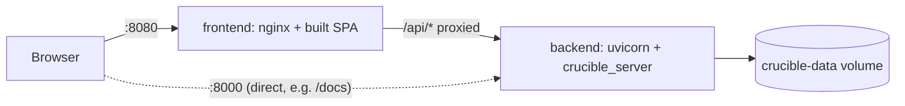

# Deployment

The easiest way to run Crucible is with Docker Compose — it builds the
backend and frontend images and wires them together, with no local Python
or Node install required.

```bash
docker compose up --build
```

- **Frontend:** [http://localhost:8080](http://localhost:8080)
- **Backend API:** [http://localhost:8000](http://localhost:8000) (interactive docs at `/docs`)

Stop everything with `Ctrl+C`, or `docker compose down`. Add `-v` to also
delete the named volume holding workflows/run history
(`docker compose down -v`).

## How it's wired together



- **`backend`** — built from the root `Dockerfile`'s `runtime` stage:
  installs the `crucible`, `crucible_server` and `crucible_workspace`
  packages and runs `uvicorn crucible_server.app:create_app`. Workflow
  files, run history and the preview cache are written to `/data` inside
  the container (`CRUCIBLE_WORKSPACE_DIR=/data`), which is backed by the
  `crucible-data` named volume so they survive container recreation.
- **`frontend`** — built from `crucible_gui/Dockerfile`'s `serve` stage: a
  multi-stage build that runs `npm run build` with
  `VITE_API_BASE_URL=/api/v1`, then serves the resulting static files with
  nginx. Nginx also reverse-proxies `/api/` to the `backend` service (see
  `crucible_gui/nginx.conf`), so the browser only ever talks to one origin
  — no CORS configuration or hardcoded backend hostname needed, and the
  same image works whether it's opened from the Docker host or another
  machine on the network.

## Persisting data

Workflows, cached previews and run history live in the `crucible-data`
volume. To inspect or back it up directly:

```bash
docker run --rm -v crucible-data:/data -v "$PWD:/backup" alpine \
  tar -C /data -czf /backup/crucible-data-backup.tar.gz .
```

To use a bind mount to a host directory instead of a named volume, override
the `backend` service's `volumes` in a `docker-compose.override.yml`:

```yaml
services:
  backend:
    volumes:
      - ./crucible-data:/data
```

## Running tests in Docker

No local Python or Node install needed here either:

```bash
docker compose run --rm backend-tests
docker compose run --rm frontend-tests
```

`backend-tests` builds the backend image's `test` stage (installs the
`dev` extra and runs `pytest`); `frontend-tests` builds the frontend's
`test` stage (installs devDependencies and runs `npm run test`, i.e.
Vitest). Both exit with the test runner's exit code, so they work as CI
steps too.

## Running the documentation site

```bash
docker compose --profile docs up --build docs
```

Serves this site at [http://localhost:8001](http://localhost:8001).

## Building images individually

Useful for pushing to a registry, or running a single piece without Compose:

```bash
docker build --target runtime -t crucible-backend .
docker build --target serve -t crucible-frontend ./crucible_gui \
  --build-arg VITE_API_BASE_URL=/api/v1

docker run -p 8000:8000 -v crucible-data:/data crucible-backend
docker run -p 8080:80 crucible-frontend
```

If the frontend and backend won't share an origin/reverse proxy in your
deployment (e.g. the frontend is served from a CDN and the backend lives
on its own domain), set `VITE_API_BASE_URL` to the backend's full URL
instead (e.g. `https://api.example.com/api/v1`) when building the frontend
image.
