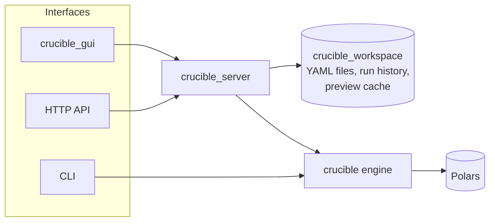

# Crucible

**A local-first workflow engine for data transformation and reporting**, built on [Polars](https://pola.rs).

Crucible lets you describe a data pipeline — read a file, reshape it, join
it with something else, write the result — as a small, declarative YAML
document, then run it from the command line, an HTTP API, or a visual
workflow editor. Nothing leaves your machine: there's no cloud service,
account, or external dependency involved in running a workflow.

```yaml
name: sales_by_country
steps:
  - key: read_csv
    parameters:
      path: sales.csv
  - key: filter_rows
    parameters:
      condition:
        left:
          column: status
        operator: "="
        right:
          value: shipped
  - key: group_by
    parameters:
      by: [country]
      aggregations:
        - column: amount
          function: sum
          alias: total_sales
  - key: write_csv
    parameters:
      path: sales_by_country.csv
```

## How it fits together



- **`crucible`** — the engine itself: loads a workflow, validates it,
  compiles each step into an executable instance, applies a couple of
  structural optimizations, and runs it against Polars. Usable directly as
  a Python library or via its bundled CLI.
- **`crucible_server`** — a FastAPI service that wraps the engine and
  workspace behind a REST API, so a UI doesn't need to embed Python.
- **`crucible_workspace`** — local storage: where workflow files, cached
  run previews, and run history live on disk.
- **`crucible_gui`** — a React single-page app for building and running
  workflows visually, talking to `crucible_server` over HTTP.

## Where to go next

- [Getting started](getting-started.md) — install Crucible and run your first workflow.
- [Writing workflows](workflows.md) — the YAML format and the full step catalog.
- [Deployment](deployment.md) — run the server and GUI with Docker.
- [Development](development.md) — set up a dev environment and run the test suites.
- [Code reference](reference.md) — generated API documentation.
