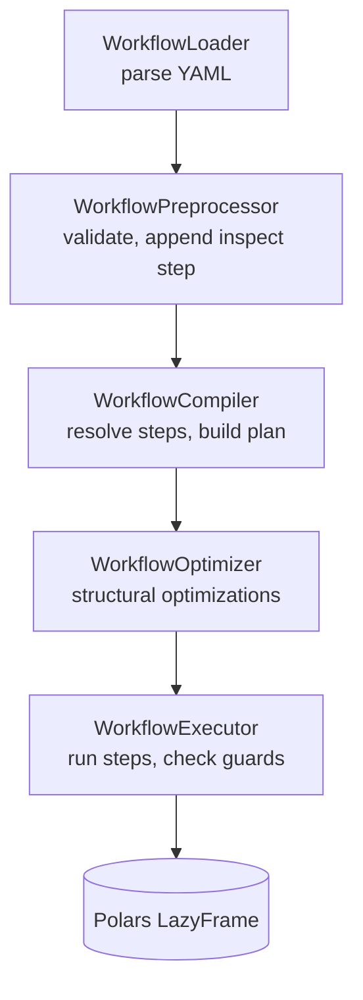

# Writing Workflows

A workflow is a YAML document with a `name` and an ordered list of `steps`.
Each step has a `key` identifying which implementation to use, and a
`parameters` block matching that step's configuration:

```yaml
name: sales_by_country
steps:
  - key: read_csv
    name: Load raw sales export       # optional, for display purposes
    description: Sales export from the ERP  # optional
    parameters:
      path: sales.csv
  - key: group_by
    parameters:
      by: [country]
      aggregations:
        - column: amount
          function: sum
          alias: total_sales
  - key: write_csv
    parameters:
      path: sales_by_country.csv
```

`name` and `description` are purely cosmetic (shown in the GUI and CLI
output) — only `key` and `parameters` affect execution. Each step's exact
parameters are defined by its Pydantic config model; the fastest way to see
them for a given step is `GET /api/v1/data/steps_schema` (or
`python -m crucible available-steps` from the CLI), which returns the live
JSON Schema for every registered step, or the [code reference](reference.md#crucible.steps)
below.

## Conditions and expressions

Steps like `filter_rows` and `replace_values` take a declarative
`condition` instead of a raw expression string:

```yaml
condition:
  left:
    column: country
  operator: "="
  right:
    value: PL
```

Conditions can be combined with `and`/`or`/`not` — see
[`crucible.declarative.conditions`](reference.md#crucible.declarative) for
the full model set and supported operators. `create_column` takes a
similar declarative `expression` instead, documented at
[`crucible.declarative.expressions`](reference.md#crucible.declarative).

## How a workflow runs



1. **Load** — `WorkflowLoader` parses the YAML into a `Workflow` model.
2. **Preprocess** — `WorkflowPreprocessor` rejects empty workflows and,
   unless disabled, appends a system `__inspect_frame` step so every run
   captures a preview and row count.
3. **Compile** — `WorkflowCompiler` looks each step's `key` up in
   `StepsRegistry`, validates its `parameters` against that step's config
   model, and builds an ordered execution plan.
4. **Optimize** — `WorkflowOptimizer` applies a handful of structural
   rewrites to the plan (e.g. pushing a following `select_columns` list
   into an immediately preceding `read_*` step, when supported).
5. **Execute** — `WorkflowExecutor` runs each step in order, checking its
   guards first (e.g. "does this file exist", "do these columns exist"),
   and stops at the first failure, recording which step failed and why.

Most steps operate on a Polars **LazyFrame** end-to-end and only
`.collect()` when a step genuinely needs eager evaluation (e.g. `pivot`) or
a run's final preview is being captured — so a long chain of
filters/selects/joins is optimized by Polars as a single query rather than
executed row-by-row per step.

## Step catalog

| Key | Name | Description |
| --- | --- | --- |
| `read_csv` | Read CSV File | Read data from a CSV file |
| `read_excel` | Read Excel File | Read data from a Excel workbook. |
| `read_folder_csv` | Read CSV Folder | Read and concatenate CSV files from a folder. |
| `read_folder_excel` | Read Excel Folder | Read and concatenate Excel files from a folder. |
| `write_csv` | Write CSV File | Write data to a CSV file |
| `write_excel` | Write Excel File | Write data to a Excel workbook. |
| `select_columns` | Select Columns | Select a subset of columns from the data. |
| `drop_columns` | Drop columns | Drop specified columns |
| `reorder_columns` | Reorder Columns | Reorder columns based on a specified list of column names. |
| `rename_columns` | Rename Columns | Rename columns based on a provided mapping. |
| `change_column_type` | Change Column Type | Change the data type of one or more columns. |
| `filter_rows` | Filter Rows | Filter rows based on a declarative condition. |
| `sort_rows` | Sort Rows | Sort rows based on specified columns and sort directions. |
| `limit_rows` | Limit rows | Limit rows to first or last n rows |
| `remove_duplicates` | Remove Duplicates | Remove duplicate rows. |
| `drop_nulls` | Drop Nulls | Remove rows containing null values. |
| `fill_nulls` | Fill Nulls | Replace null values with a specified value. |
| `fill_down` | Fill Down | Fill null values with the previous non-null value. |
| `replace_values` | Replace Values | Replace values in a column. |
| `create_column` | Create Column | Create a new column from a declarative expression. |
| `split_column` | Split Column | Split a text column into multiple columns. |
| `regex_extract` | Regex Extract | Extract text from a column using a regular expression. |
| `join` | Join | Join two datasets |
| `concat` | Concatenate | Append rows from multiple sources |
| `group_by` | Group By | Group rows and calculate aggregations. |
| `pivot` | Pivot | Pivot the data from long to wide format. |
| `unpivot` | Unpivot | Unpivot the data from wide to long format. |
| `parse_datetime` | Parse Date/Time | Parse a text column into date, datetime, or time. |
| `extract_date_time` | Extract Date/Time | Extract date or time from a datetime column. |
| `extract_datetime_part` | Extract Date/Time Part | Extract a selected part from a date, datetime, or time column. |
| `date_add` | Date Add | Add or subtract duration from a date or datetime column. |
| `date_diff` | Date Difference | Calculate difference between two date or datetime values. |
| `date_range_filter` | Date Range Filter | Filter rows where a date or datetime column is within a range. |
| `date_period_filter` | Date Period Filter | Filter rows belonging to the current year, month or day. |

`__inspect_frame` also exists but is a system step the preprocessor inserts
automatically — it isn't meant to be added to a workflow by hand.

Full parameter details for every step are in the
[code reference](reference.md#crucible.steps).
